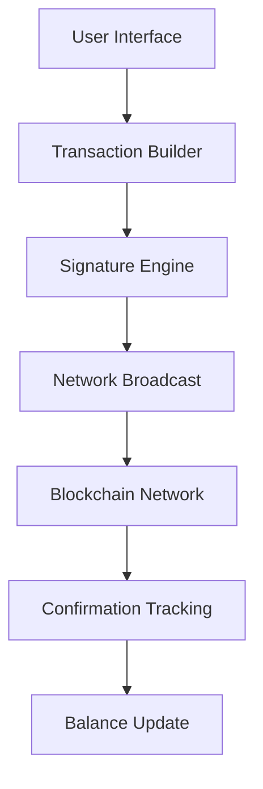

# Understanding the Principles of Cryptocurrency Wallets  

Cryptocurrency wallets serve as essential tools for interacting with blockchain networks. This comprehensive guide explores their technical foundations, operational mechanisms, and practical implementation considerations.  

## Core Components of Cryptocurrency Wallets  

### What Is a Cryptocurrency Wallet?  

Contrary to popular belief, cryptocurrency wallets don't store digital assets directly. Instead, they manage cryptographic keys that grant users control over their funds on the blockchain. Key functions include:  

- **Private/public key management**: Wallets generate and securely store cryptographic key pairs  
- **Transaction signing**: Enables users to authorize transfers through digital signatures  
- **Balance tracking**: Interfaces with blockchain data to display available balances  
- **Address generation**: Creates unique receiving addresses derived from public keys  

The blockchain itself records all transactions as unspent transaction outputs (UTXOs). When a user sends cryptocurrency, their wallet constructs a transaction referencing specific UTXOs, which must be validated by network nodes.  

### Critical Security Insight  
👉 [Explore OKX for secure wallet solutions](https://bit.ly/okx-bonus)  

## Blockchain Verification Mechanisms  

### Full Node Wallets  

Full nodes like Bitcoin Core maintain complete blockchain copies (currently over 400GB). They offer maximum security through:  
- Independent transaction validation  
- No reliance on third-party data  
- Contribution to network decentralization  

### Simplified Payment Verification (SPV)  

SPV wallets (used by mobile clients) verify transactions without full blockchain access:  
1. **Merkle Tree Verification**: Uses Merkle proofs to confirm transaction inclusion in blocks  
2. **Bloom Filters**: Reduces data load by filtering relevant transactions  
3. **Header-Only Sync**: Stores 80-byte block headers (4MB/year) instead of full blocks  

Comparison Table:  
| Feature          | Full Node Wallet | SPV Wallet       | Centralized Wallet |  
|------------------|------------------|------------------|--------------------|  
| Data Storage     | 400+ GB          | ~4MB/year        | Server-Dependent   |  
| Validation       | Independent      | Partial          | Third-Party Trust  |  
| Sync Time        | Days             | Minutes          | Instant            |  
| Security Level   | Highest          | Moderate         | Lowest             |  

### Centralized Wallets  

Operate through proprietary servers, offering:  
- Instant transaction processing  
- Simplified user interfaces  
- Trade-offs in security and control  

## Multi-Currency Wallet Integration  

### Technical Approaches  

1. **API Aggregation**: Centralized wallets implement separate APIs for each blockchain  
2. **Multi-Chain Frameworks**: Solutions like Ethereum's ERC-20 standard enable token compatibility  
3. **HD Wallet Architecture**: Hierarchical deterministic wallets use BIP-32/BIP-44 standards to manage multiple chains from single seed phrases  

### Implementation Challenges  
- **Key Management**: Maintaining separate private keys per blockchain  
- **Performance**: Handling cryptographic operations across multiple chains  
- **Storage**: Managing chain-specific metadata  

## Transaction Lifecycle Explained  

### Sending Cryptocurrency  
1. Wallet selects appropriate UTXOs  
2. Constructs transaction with recipient's address  
3. Applies digital signature using private key  
4. Broadcasts transaction to network  

### Receiving Cryptocurrency  
1. Wallet monitors blockchain for matching addresses  
2. Validates transaction inclusion in blocks  
3. Updates balance display after required confirmations  

### Data Flow Architecture  

## Mobile Wallet API Design  

### Essential Endpoints  
1. **Balance Query**: `/api/v1/wallet/balance`  
2. **Transaction History**: `/api/v1/wallet/transactions`  
3. **Payment Processing**: `/api/v1/wallet/send`  
4. **Address Generation**: `/api/v1/wallet/address`  

### Security Measures  
- **Rate Limiting**: Prevents API abuse  
- **HMAC Authentication**: Ensures request integrity  
- **TLS 1.3**: Secures data transmission  

## Frequently Asked Questions  

### How do cryptocurrency transactions work?  
Transactions transfer ownership through cryptographic signatures. When sending funds, your wallet constructs a transaction referencing specific UTXOs, which gets validated by network nodes after multiple confirmations.  

### What's the difference between full node and SPV wallets?  
Full nodes maintain complete blockchain copies for maximum security, while SPV wallets verify transactions through Merkle proofs and block headers, offering faster synchronization with reduced security guarantees.  

### Can multiple cryptocurrencies coexist in one wallet?  
Yes, through:  
- API aggregation (centralized approach)  
- Multi-chain frameworks (BIP-44 standard)  
- Specialized wallet infrastructure (e.g., Trust Wallet)  

### How are wallet APIs secured for mobile clients?  
Security measures include HMAC authentication, TLS encryption, and rate limiting. Centralized wallets may implement additional protections like biometric verification.  

### Is my private key secure in a lightweight wallet?  
SPV wallets maintain private key security through local storage, but users should consider hardware wallets for large holdings. Always verify wallet reputation and security audits.  

👉 [Discover enterprise-grade wallet security at OKX](https://bit.ly/okx-bonus)  

## Wallet Selection Considerations  

### Security Recommendations  
- **Cold Storage**: Use hardware wallets (Ledger, Trezor) for long-term holdings  
- **Hot Wallets**: Software wallets like Electrum for frequent transactions  
- **Watch-Only Wallets**: For monitoring balances without exposing private keys  

### Performance Metrics  
| Wallet Type      | Sync Time | Storage  | Security Level |  
|------------------|-----------|----------|----------------|  
| Full Node        | Days      | 400+ GB  | ★★★★★          |  
| SPV (Mobile)     | Minutes   | ~500 MB  | ★★★☆☆          |  
| Centralized      | Instant   | Server   | ★★☆☆☆          |  

### Emerging Trends  
- **Quantum-Resistant Algorithms**: Preparing for post-quantum cryptography  
- **Cross-Chain Bridges**: Facilitating interoperability between blockchains  
- **Biometric Integration**: Enhanced security through fingerprint/face recognition  

## Development Best Practices  

### Open Source Collaboration  
As demonstrated by projects like Bitcoin Core and Litecoin, decentralized development fosters innovation through:  
- Transparent code reviews  
- Community-driven improvements  
- Distributed testing environments  

### Implementation Checklist  
1. Choose appropriate wallet type (full node/SPV/centralized)  
2. Implement BIP standards (BIP-32/39/44)  
3. Integrate multi-currency support  
4. Optimize cryptographic operations for mobile  
5. Conduct third-party security audits  

👉 [Join OKX's developer community for advanced wallet integration](https://bit.ly/okx-bonus)  

## Conclusion  

Cryptocurrency wallets represent the critical interface between users and blockchain networks. Understanding their technical foundations—from cryptographic key management to transaction validation—enables informed decisions about security, usability, and implementation strategies. As blockchain technology evolves, wallet developers must balance convenience with security while embracing emerging standards and cross-chain interoperability solutions.  

This comprehensive guide has explored:  
- Wallet architecture fundamentals  
- Transaction verification mechanisms  
- Multi-currency integration approaches  
- Mobile wallet design considerations  
- Security best practices  

Whether developing new wallet solutions or selecting appropriate storage methods, this knowledge forms the foundation for secure and efficient cryptocurrency management in 2025 and beyond.